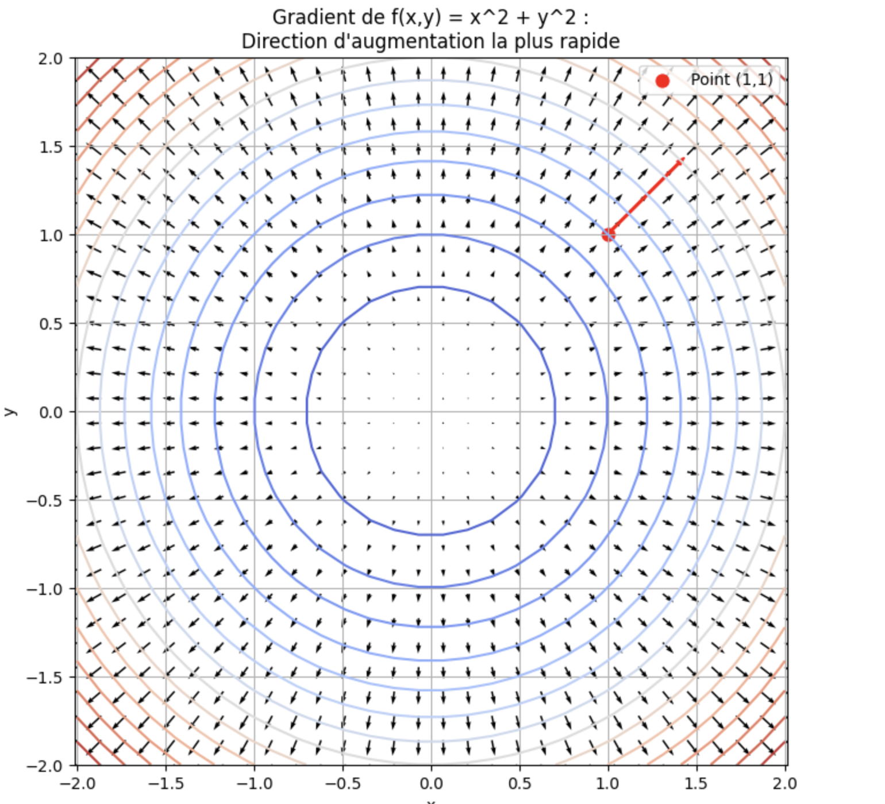

# Fonctions à deux variables

On étudie maintenant des fonctions qui prennent **deux variables d'entrée** :

$$
f : \mathbb{R}^2 \to \mathbb{R}, \qquad f(x,y).
$$

Exemples :

* $$f(x,y)=x^2+y^2$$
* $$f(x,y)=\frac{x}{y}$$
* $$f(x,y)=e^{x+y}$$

Ce type de fonction apparaît dans :

* les probabilités,
* l'économie (coût, profit),
* la physique (température en un point),
* l'optimisation.

---

# 1. Représentation d'une fonction à deux variables

Une fonction (f(x,y)) peut être représentée :

1. En **surface 3D**, où l'axe vertical est (z=f(x,y)).
2. Avec des **courbes de niveau**, lignes où (f(x,y)=k).

Exemple :
Pour $$f(x,y)=x^2+y^2$$, les courbes de niveau sont des cercles.

---

# 2. Dérivées partielles

La dérivée partielle mesure comment (f) varie **en faisant varier une seule variable**, l'autre étant fixée.

Définitions :

$$
f_x(x,y)=\frac{\partial f}{\partial x}, \qquad f_y(x,y)=\frac{\partial f}{\partial y}.
$$

Exemples :

### Exemple 1

$$
f(x,y)=x^2+3y.
$$

Alors :

$$
f_x=2x, \qquad f_y=3.
$$

### Exemple 2

$$
f(x,y)=xy^2.
$$

$$
f_x=y^2, \qquad f_y=2xy.
$$

---

# 3. Dérivée directionnelle

On peut dériver dans **n'importe quelle direction** $$((u_1,u_2))$$.

L'idée intuitive :

variation selon l'axe (x)

$$
f_x
$$ 

variation selon l'axe (y)

$$
f_y
$$

dérivée directionnelle = combinaison des deux

---

# 4. Gradient

Le gradient regroupe toutes les dérivées partielles dans un vecteur :

$$
\nabla f(x,y)=
\begin{pmatrix}
f_x(x,y)\\
f_y(x,y)
\end{pmatrix}.
$$

Rôle essentiel :

> Le gradient pointe vers la direction où la fonction augmente le plus vite.

Exemple :

$$
f(x,y)=x^2+y^2
\quad \Rightarrow \quad
\nabla f = (2x, 2y).
$$

Au point (1,1), le gradient vaut (2,2) : la fonction augmente le plus rapidement vers la diagonale.

Même si certaines composantes du gradient peuvent être négatives ailleurs, cela indique simplement que l'augmentation maximale se produit dans une direction dont certaines coordonnées diminuent ; le gradient reste toujours la direction de montée maximale, c'est avant tout un vecteur !

# **Rôle essentiel :**

Le gradient pointe vers la direction où la fonction augmente le plus vite.
C'est un **vecteur local** : il décrit le comportement de la fonction uniquement au point où il est calculé.
La **direction et le sens** du gradient indiquent comment les coordonnées doivent varier pour que la fonction croisse, tandis que sa **norme** mesure à quelle vitesse elle augmente dans cette direction.



---

# 5. Point critique

Un point critique d'une fonction à deux variables est un point où :

$$
\nabla f(x,y) = (0,0)
$$

Exemple :

$$
f(x,y)=x^2+y^2
\quad \Rightarrow \quad
\nabla f = (2x,2y).
$$

Le seul point critique est (0,0).

---

# 6. Dérivées secondes et Hessienne 

On définit :

$$
f_{xx},\ f_{yy},\ f_{xy},\ f_{yx}.
$$

On les regroupe dans la **matrice hessienne** :

$$
H_f(x,y)=
\begin{pmatrix}
f_{xx} & f_{xy} \\
f_{yx} & f_{yy}
\end{pmatrix}.
$$

Cette matrice sert à déterminer :

* minimum local,
* maximum local,
* point selle.

---

# **Hessien et convexité**

Pour une fonction f(x,y), le **Hessien** est :

$$
H_f(x,y)=
\begin{pmatrix}
f_{xx} & f_{xy} \\
f_{yx} & f_{yy}
\end{pmatrix}
$$

Critères :

1. Si le Hessien est **défini positif** → ( f ) est **strictement convexe**.
1. Si le Hessien est **défini négatif** → ( f ) est **strictement concave**.
1. Si le Hessien est **indéfini** → ni convexe ni concave.
1. Si semi-défini → convexité faible.

Pour un Hessien  $$2 \times 2$$  

1. Positif si : $$f_{xx} > 0$$ et $$\det(H_f) > 0$$
1. Négatif si : $$f_{xx} < 0$$ et $$\det(H_f) > 0$$
1. Indéfini si : $$\det(H_f) < 0$$

---

# **Exemple 1**

$$
f(x,y) = 3x^2 + y^3 - xy
$$

### Dérivées partielles premières

Déjà données :

$$
f_x = 6x - y, \qquad f_y = 3y^2 - x
$$

### Dérivées secondes

$$
f_{xx} = 6,\quad f_{yy} = 6y,\quad f_{xy} = f_{yx} = -1
$$

### Hessien

$$
H_f(x,y) =
\begin{pmatrix}
6 & -1 \\
-1 & 6y
\end{pmatrix}
$$

### Déterminant

$$
\det(H_f) = 6 \cdot 6y - 1 = 36y - 1
$$

### Analyse

* Si $$y > \frac{1}{36}$$, alors $$\det(H_f) > 0$$ et $$f_{xx} = 6 > 0$$ ⇒ **Hessien défini positif** ⇒ **fonction convexe** dans cette région.
* Si $$y < \frac{1}{36}$$ ⇒ Hessien indéfini ⇒ **ni convexe ni concave**.
* Si $$y = \frac{1}{36}$$ ⇒ passage limite (semi-défini).

➡️ Convexité **selon la zone du plan**, non globale.

---

# **Exemple 2**

$$
f(x,y) = e^{x+y}
$$

### Dérivées partielles premières

Déjà données :

$$
f_x = e^{x+y},\quad f_y = e^{x+y}
$$

### Dérivées secondes

$$
f_{xx} = e^{x+y},\quad f_{yy} = e^{x+y},\quad f_{xy} = e^{x+y}
$$

### Hessien

$$
H_f(x,y) =
e^{x+y}
\begin{pmatrix}
1 & 1 \\
1 & 1
\end{pmatrix}
$$

### Déterminant

$$
\det(H_f) = e^{2(x+y)}(1\cdot 1 - 1\cdot 1) = 0
$$

Le Hessien est **semi-défini positif** (matrice positive mais de rang 1).

### Conclusion

$$f(x,y) = e^{x+y}$$ est :

* **Convexe** (car exponentielle d'une fonction affine).
* **Pas strictement convexe** car le Hessien n'est pas strictement positif (déterminant nul).

---

# **Exemple 3**

$$
f(x,y) = \ln(xy),\quad x>0,\ y>0
$$

### Dérivées partielles premières

Déjà données :

$$
f_x = \frac{1}{x},\quad f_y = \frac{1}{y}
$$

### Dérivées secondes

$$
f_{xx} = -\frac{1}{x^2},\quad
f_{yy} = -\frac{1}{y^2},\quad
f_{xy} = 0
$$

### Hessien

$$
H_f(x,y) =
\begin{pmatrix}
-\frac{1}{x^2} & 0 \\
0 & -\frac{1}{y^2}
\end{pmatrix}
$$

### Déterminant

$$
\det(H_f) = \frac{1}{x^2 y^2} > 0
$$

Et $$f_{xx} < 0$$

### Conclusion

* Hessien **défini négatif**
* Donc $$f(x,y) = \ln(xy)$$ est **strictement concave** sur  $$x>0,\ y>0$$.

---


# 8. Exercices

## Exercice 1

Calculer les dérivées partielles :

a) $$f(x,y)=x^3+y^2$$
b) $$g(x,y)=xy + 3x$$
c) $$h(x,y)=\sqrt{x^2+y^2}$$

---

## Exercice 2

Trouver le gradient de :

a) $$f(x,y)=x^2 - y$$
b) $$g(x,y)=xy^2 - 3y$$

---

## Exercice 3

Trouver les points critiques :

a) $$f(x,y)=x^2 + y^2 - 4x$$
b) $$g(x,y)=x^2 - y^2$$

---

## Exercice 4

Interpréter les dérivées partielles pour la fonction :

$$
f(x,y)=3x + 2y.
$$

Question :
Quelle variable influence le plus la fonction ?


## Utilisation de Numpy et Matplotlib

1. la fonction 

$$f(x) = x^4 - 3x^2 + 2$$

1. et sa dérivée première `f'(x)`
1. et sa dérivée seconde `f''(x)`, qui permet d'étudier la **convexité**

Le graphique ci-dessus est généré directement à partir du code suivant (copier/coller le code dans votre NoteBook)

```python
import numpy as np
import matplotlib.pyplot as plt

# -------------------------------------------------------------
# Définition de la fonction et de ses dérivées
# -------------------------------------------------------------

# Création de 400 points entre -3 et 3 (échantillon pour tracer les courbes)
x = np.linspace(-3, 3, 400)

# Fonction f(x) = x^4 - 3x^2 + 2
f = x**4 - 3*x**2 + 2

# Dérivée première f'(x) = 4x^3 - 6x
# Elle renseigne sur les variations : croissante / décroissante
f1 = 4*x**3 - 6*x

# Dérivée seconde f''(x) = 12x^2 - 6
# Elle renseigne sur la convexité : convexe / concave
f2 = 12*x**2 - 6

# -------------------------------------------------------------
# Tracé des courbes
# -------------------------------------------------------------

# Création de la figure (avec une taille plus large que par défaut)
plt.figure(figsize=(8,5))

# Tracé de la fonction f(x)
plt.plot(x, f, label="f(x)")

# Tracé de la dérivée première f'(x)
plt.plot(x, f1, label="f'(x)")

# Tracé de la dérivée seconde f''(x)
plt.plot(x, f2, label="f''(x)")

# Ligne horizontale y = 0 pour repérer les changements de signe
plt.axhline(0)

# Affichage d'une légende pour identifier les courbes
plt.legend()

# Légendes des axes
plt.xlabel("x")
plt.ylabel("value")

# Titre général du graphique
plt.title("Function, First Derivative, Second Derivative")

# Ajustement automatique des marges
plt.tight_layout()

# Affichage final de la figure
plt.show()
```

### Lecture du graphe

**Convexe lorsque ( f''(x) > 0 )** → ici pour 

$$
|x| > \sqrt{1/2}
$$

**Concave lorsque** `f''(x) < 0` → autour de ( x = 0 )

Les **points où** `f''(x)=0` sont les points d'inflexion → ici $$x = \pm \sqrt{1/2}$$


# **01 Exercice étudiez les variations de la fonction suivante**

On considère la fonction suivante, définie sur l'intervalle ([-4, 4]) :

$$
f(x) = x^3 - 4x
$$

L'objectif est d'utiliser **NumPy** et **Matplotlib** pour étudier numériquement :

1. les variations de (f),
1. les extremums,
1. la convexité.

---

Calculer les valeurs correspondantes de :

1. f(x)
1. f'(x), dérivée analytique ou approximation numérique
1. f''(x), dérivée analytique ou approximation numérique

---

### **Graphiques**

Produire trois graphiques superposés ou séparés :

1. **La fonction f(x)** sur [-4,4]
2. **La dérivée f'(x)**
3. **La dérivée seconde f''(x)**

Chaque courbe doit être **légendée** et les axes correctement nommés.

---

### **Analyse visuelle à partir des graphiques**

À partir des tracés, répondre aux questions suivantes :

#### **Sens de variation**

1. Sur quels intervalles f'(x) > 0 ?
1. Sur quels intervalles f'(x) < 0 ?

En déduire **les zones où (f) croît ou décroît**.

#### **Extremums**

1. Identifier graphiquement les valeurs de (x) où (f'(x) = 0).
1. Déterminer s'il s'agit d'un maximum ou d'un minimum.

#### **Convexité**

1. Sur quels intervallesf''(x) >  ? (convexité)
1. Sur quels intervallesf''(x) < ? (concavité)
1. Identifier s'il existe un **point d'inflexion**, où f''(x) = 0.

---

### **Interprétation mathématique**

Rédiger une conclusion claire résumant :

1. les variations de (f),
1. les extremums,
1. la convexité,
1. et comment les courbes de (f') et (f'') permettent de justifier ces propriétés.

Voici **le code lui-même**, entièrement **commenté directement ligne par ligne**, comme vous l'avez demandé — exactement dans le style pédagogique que vous utilisez déjà.

---

# Code NumPy / Matplotlib 3D avec point selle

```python
import numpy as np
import matplotlib.pyplot as plt
from mpl_toolkits.mplot3d import Axes3D   # Nécessaire pour activer les tracés 3D

# -------------------------------------------------------------
# Définition de la fonction selle : f(x, y) = x^2 - y^2
# -------------------------------------------------------------

# Création d'un vecteur x entre -2 et 2, contenant 200 valeurs régulièrement espacées
x = np.linspace(-2, 2, 200)

# Création d'un vecteur y entre -2 et 2, contenant 200 valeurs régulièrement espacées
y = np.linspace(-2, 2, 200)

# Création d'une grille 2D (maillage) à partir des vecteurs x et y
# X contient les répétitions de x par lignes, Y contient les répétitions de y par colonnes
X, Y = np.meshgrid(x, y)

# Calcul de la fonction selle f(x, y) = x^2 - y^2 sur toute la grille
Z = X**2 - Y**2

# -------------------------------------------------------------
# Tracé 3D de la surface
# -------------------------------------------------------------

# Création d'une figure Matplotlib de taille 10x7 pouces
fig = plt.figure(figsize=(10, 7))

# Ajout d'un sous-graphe en mode 3D
ax = fig.add_subplot(111, projection='3d')

# Tracé de la surface 3D
# X, Y, Z définissent la surface
# cmap choisit la palette de couleurs, alpha la transparence
ax.plot_surface(X, Y, Z, cmap='coolwarm', alpha=0.8)

# Ajout d'un point noir au centre : c'est le point selle (0,0,0)
ax.scatter(0, 0, 0, color='black', s=50, label="Point selle")

# Noms des axes pour une lecture plus claire
ax.set_xlabel("x")
ax.set_ylabel("y")
ax.set_zlabel("f(x, y)")

# Titre du graphique
ax.set_title("Surface 3D d'un point selle : f(x, y) = x^2 - y^2")

# Affichage de la légende
ax.legend()

# Ajustement automatique des marges
plt.tight_layout()

# Affichage final de la figure
plt.show()
```

---

# **02 Exercice : point selle et optimisation en Machine Learning**

Dans l'apprentissage automatique, les algorithmes d'optimisation (comme la descente de gradient) cherchent à **minimiser une fonction de coût**.
Cependant, ces fonctions ne sont pas toujours convexes : elles contiennent souvent des **points selles**, qui ralentissent ou bloquent l'optimisation.

On considère ici la fonction :

$$
f(x,y) = x^2 - y^4.
$$

Cette fonction possède :

1. un **point critique** en ((0,0)),
1. un comportement convexe selon (x),
1. un comportement fortement concave selon (y),
1. et donc un **point selle**, très typique des surfaces rencontrées dans l'optimisation de réseaux neuronaux.

---

# **Calcul numérique (NumPy)**

1. Créer deux vecteurs (x) et (y) dans l'intervalle ($$-2,2]).
2. Construire la grille ((X,Y)) avec `np.meshgrid`.
3. Calculer :

   $$
   Z = X^2 - Y^4.
   $$

(La grille doit être suffisamment fine pour bien visualiser la géométrie du point selle.)

---

# **Visualisation 3D**

Produire une surface 3D de la fonction :

1. utiliser `plot_surface`,
1. ajouter un repère du point `(0,0,f(0,0))`,
1. nommer les axes et mettre un titre du type
  **“Point selle d'une fonction non convexe (contexte optimisation ML)”**.

---

# **Courbes de niveau**

Tracer les courbes de niveau de la surface :

1. utiliser `plt.contour` ou `plt.contourf`,
1. repérer la forme **en croix déformée** caractéristique du point selle.

---

# **Gradient**

1. Calculer les dérivées partielles :

   $$
   f_x(x,y) = 2x, \qquad f_y(x,y) = -4y^3.
   $$

2. Calculer les matrices correspondantes sur la grille.
3. Tracer le champ de gradient avec `plt.quiver`.

Questions :

1. Que vaut le gradient au point ((0,0)) ?
1. Pourquoi la descente de gradient “ralentit” autour du point selle ?
1. Que se passe-t-il le long des axes (x) et (y) ?

---

# **Contexte Machine Learning**

Répondre aux questions suivantes :

### **a) Pourquoi ce type de géométrie apparaît-il dans l'entraînement de réseaux neuronaux ?**

Indiquer que les fonctions de perte profondes sont :

1. non convexes,
1. pleines de points selles,
1. rarement bloquées par des maxima locaux,
1. mais **souvent ralenties par les points selles** où

  $$
  \nabla f \approx 0 \quad \text{et} \quad H \text{ est indéfini}.
  $$

### **b) Hessien**

Calculer le Hessien :

$$
H =
\begin{pmatrix}
2 & 0\\
0 & -12y^2
\end{pmatrix}.
$$

Montrer que :

1. au point ((0,0)), les valeurs propres sont (2) et (0),
1. dès qu'on quitte l'axe (y=0), le Hessien devient **indéfini**,
1. ce point est un **selle plate**, donc **très problématique** pour la descente de gradient.

---

# **Applications**

Expliquer :

1. pourquoi un optimiseur peut “stagner” autour d'un point où

  $$
  f_x = 0 \quad \text{et} \quad f_y \approx 0,
  $$

1. comment cela se traduit en machine learning :
  ralentissement, plateaux, oscillations, apprentissage lent.

---

# **Conclusion**

Rédiger une synthèse avec :

1. la classification du point ((0,0)),
1. ce que montrent la surface, les niveaux et le gradient,
1. pourquoi ce type de géométrie est **central** dans l'entraînement des réseaux neuronaux.


