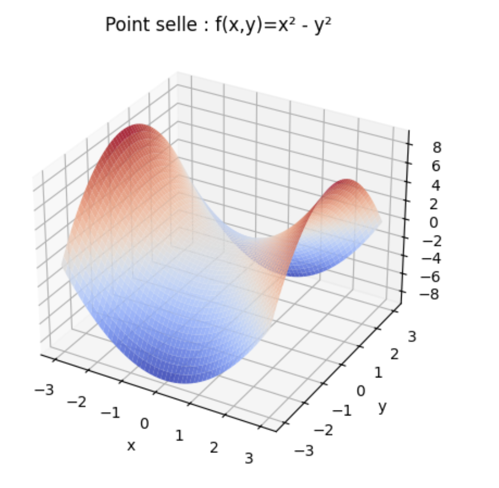

#  **Cours : Fonctions de deux variables, dérivées partielles, gradient et Hessien**

---

#  Fonctions à deux variables

Une fonction de deux variables est une application :

$$
f : \mathbb{R}^2 \to \mathbb{R},\quad f(x,y).
$$

On la rencontre en :

1. probabilités (densités),
1. économie (coût, profit),
1. physique (température, potentiel),
1. optimisation (machine learning, statistiques).

Exemples simples :

$$
f(x,y)=x^2+y^2,\quad
f(x,y)=e^{x+y},\quad
f(x,y)=\frac{x}{y}\ (y\neq0).
$$

---

#  Représentations

## a) Surface 3D

On visualise `z=f(x,y)` dans l'espace.

## b) Courbes de niveau

Courbes `f(x,y)=c`

Exemple : pour 

$$
f(x,y)=x^2+y^2
$$

ce sont des cercles.

---

#  Dérivées partielles

Elles décrivent comment (f) varie lorsqu'on modifie **seulement une variable**.

$$
f_x=\frac{\partial f}{\partial x},\qquad
f_y=\frac{\partial f}{\partial y}.
$$

Exemples :

$$
f(x,y)=x^2+3y
$$

$$
f_x=2x,\quad f_y=3
$$

$$
f(x,y)=xy^2
$$

$$
f_x=y^2,\quad f_y=2xy
$$

---

#  Dérivée directionnelle

La fonction peut varier selon **n'importe quelle direction** 

$$
u=(u_1,u_2)
$$

Définition :

$$
D_u f(x,y)=f_x u_1 + f_y u_2.
$$

C'est une **combinaison pondérée** des dérivées partielles.

---

#  Gradient

Le gradient regroupe les deux dérivées partielles :

$$
\nabla f(x,y)=
\begin{pmatrix}
f_x\
f_y
\end{pmatrix}.
$$

**Interprétation :**

1. c'est un vecteur **local**, calculé en un point donné,
1. il pointe vers **la direction de variation la plus rapide**,
1. sa norme donne **l'intensité** de cette augmentation maximale.

Exemple :

$$
f(x,y)=x^2+y^2
\quad\Rightarrow\quad
\nabla f=(2x,2y)
$$

---

# Points critiques

Un point critique est un point où :

$$
\nabla f(x,y)=0
$$

Ce sont les candidats à :

1. minimum local,
1. maximum local,
1. point-selle.

---

# Dérivées secondes et Hessien

On définit :

$$
f_{xx},, f_{yy},, f_{xy},, f_{yx}.
$$

Le **Hessien** est :

$$
H_f=
\begin{pmatrix}
f_{xx} & f_{xy} \\
f_{yx} & f_{yy}
\end{pmatrix}.
$$

Il sert à analyser :

1. convexité / concavité,
1. **nature des points critiques.**

---
## Hessienne

La Hessienne est symétrique si les dérivées secondes sont continues...

Toute matrice symétrique a :
1. des valeurs propres réelles,
1. une base de vecteurs propres,
1. une diagonalisation orthogonale.

---

# Convexité et Hessien 

Test avec Numpy

```python
eigvals = np.linalg.eigvals(H)
is_strictly_convex = np.all(eigvals > 0)
```

> `is_strictly_convex` minimum local unique

---

## Minimum local 


---

## Fonction strictement concave


```python
eigvals = np.linalg.eigvals(H)
is_strictly_concave = np.all(eigvals < 0)
```

> `is_strictly_convex` maximum local unique.

---


---

##  Point-selle 

```python
eigvals = np.linalg.eigvals(H)
is_saddle_point = np.any(eigvals < 0) and np.any(eigvals > 0)
```
> `is_saddle_point` présence d'au moins une valeur propre positive et d'au moins une négative.
> Le point critique n'est ni un minimum ni un maximum, c'est un point selle.

---

Exemple code Python

```python
import numpy as np

# Hessien de f(x, y) = x^2-y^2
H = np.array([
    [2, 0],
    [0, -2]
], dtype=float)

eigvals = np.linalg.eigvals(H)

print("Valeurs propres :", eigvals)

is_saddle = np.any(eigvals > 0) and np.any(eigvals < 0)
print("Point selle :", is_saddle)
```

---



---

##  Cas indécidable

```python
# Cas indécidable : une ou plusieurs valeurs propres = 0 
is_indecidable = np.any(np.isclose(eigvals, 0))
print("Cas indécidable :", is_indecidable)
```

> la méthode du Hessien ne permet pas de conclure.
> Le point critique peut être : un minimum non strict, un maximum non strict, ou un point selle.
Il faut utiliser d'autres méthodes (développement plus poussé, étude de la fonction directement, etc.).

---

# Exemples 

$$
f(x,y)=x^2+y^2
$$

$$
\nabla f=(2x,2y)
$$

point critique : (0,0)

$$
H=\begin{pmatrix}
2&0\\
0&2
\end{pmatrix}
$$

déterminant positif → **minimum global**.

$$
f_{xx}>0
$$

$$
f(x,y)=x^2-y^2
$$

---

1. gradient nul en (0,0)
1. Hessien évalué au point `(0,0)`

$$
H=\begin{pmatrix}
2&0\\
0&-2
\end{pmatrix}
$$


---

## Exercice  — Dérivées partielles

Calculer (f_x) et (f_y) pour :

a) 

$$
f(x,y)=x^3+2xy
$$

b) 

$$
f(x,y)=e^{xy}
$$

c) 

$$
f(x,y)=\ln(x+y)
$$

domaine : `x+y>0`

---

## Exercice  — Gradient

Donner le gradient :

a) 

$$
f(x,y)=3x^2 - y
$$

b) 

$$
f(x,y)=xy + x^2
$$

c) 

$$
f(x,y)=\sqrt{x^2+y^2}
$$

attention à la dérivation

---

## Exercice  — Points critiques

Trouver et classifier les points critiques de :

a) 

$$
f(x,y)=x^2+y^2-4x
$$

b) 

$$
f(x,y)=x^2-y^2
$$

c) 

$$
f(x,y)=x^3 - 3xy^2 
$$

**fonction classique en optimisation**

---

## Exercice — Hessien et convexité

Pour chaque fonction, calculer le Hessien et conclure :

a) 

$$
f(x,y)=3x^2 + y^2 - xy
$$

---

## Exercice  — Dérivée directionnelle

Pour :

$$
f(x,y)=x^2+3y
$$

calculer la dérivée directionnelle en direction du vecteur (u=(1,2)).
(Normaliser le vecteur.)

---

## Exercice  — Approximations locales

Montrer que pour de petits 

$$
(\Delta x), (\Delta y) 
$$

$$
f(x+\Delta x, y+\Delta y)\approx f(x,y) + \nabla f \cdot (\Delta x,\Delta y)
$$

Appliquer à :

$$
f(x,y)=x^2+2y
$$

au point `(1,1)` pour 

$$
(\Delta x,\Delta y)=(0.1,-0.2).
$$

>**Près d'un point, une fonction est presque linéaire.**

---

## Exercice  — Lien optimisation / Machine Learning

Pourquoi le gradient chute-t-il vers 0 dans :

$$
f(x,y)=x^2 - y^4
$$

au point (0,0) ?
Pourquoi cela pose-t-il problème à l'algorithme de descente de gradient ?


---
## Exercice — Étude et classification d'un point critique

On considère la fonction suivante, définie sur 

$$
\mathbb{R}^2 \setminus {(0,0)}
$$

$$
g(x,y)= xy - \ln(3x^2 + y^2)
$$

1. **Calculer les dérivées partielles premières** de (g).
2. **Déterminer les points critiques** de (g).
3. **Calculer les dérivées secondes** et établir la **Hessienne générale**.
4. **Évaluer la Hessienne** au point critique obtenu précédemment.
5. **Utiliser le déterminant du Hessien** pour classifier la nature du point critique
   (minimum local, maximum local, ou point-selle).

---

# Dimension supérieur à 2

On va raisonner par rapport aux valeurs propres, car leur signe indique directement la courbure de la fonction. Soit 
`𝐻` la Hessienne évaluée en un point critique (où le gradient s'annule).

`vals = np.linalg.eigvals(H)`

---

Code Python théorique pour déterminer la nature de ces points à partir de la Hessienne.

```python
import numpy as np

def analyse_hessienne(H):
    vals =  vals = np.linalg.eigvals(H)
    print("H =\n", H)
    print("Valeurs propres :", vals)

    if np.all(vals > 0):
        print("Conclusion : Hessienne définie positive → fonction convexe → minimum local.\n")
    elif np.all(vals < 0):
        print("Conclusion : Hessienne définie négative → fonction concave → maximum local.\n")
    elif np.any(vals == 0):
        print("Conclusion : Valeur propre nulle → test inconcluant.\n")
    else:
        print("Conclusion : Signes mélangés → point selle (ni convexe ni concave).\n")

```

---

Les exemples qui suivent s'appliqueraient à un point en particulier où le gradient s'annulerait.

$$
(x_0, x_1, x_2)
$$

---


# Exemple 1 : Hessienne définie positive (convexe)

```python

H1 = np.array([
    [4, 1, 0],
    [1, 3, 2],
    [0, 2, 5]
])
analyse_hessienne(H1)

```

---

# Exemple 2 : Hessienne définie négative (concave)

```python

H2 = np.array([
    [-2, 0, 0],
    [0, -3, 1],
    [0, 1, -4]
])
analyse_hessienne(H2)

```

---

# Exemple 3 : Hessienne avec signes mélangés (selle)

```python

H3 = np.array([
    [2, 1, 0],
    [1, -1, 0],
    [0, 0, 3]
])
analyse_hessienne(H3)

```

---

# Exemple 4 : Valeur propre nulle (test inconcluant)

```python

H4 = np.array([
    [1, 0, 0],
    [0, 0, 2],
    [0, 2, 3]
])
analyse_hessienne(H4)
```

---

# Exercice 

Conclure 

```python
import numpy as np

# Hessienne dimension 5
H = np.array([
    [4, 1, 0, 0, 2],
    [1, 3, 2, 0, 0],
    [0, 2, 5, 1, 0],
    [0, 0, 1, 2, 1],
    [2, 0, 0, 1, 3]
])

```

## Vecteur gradient

Le gradient est un vecteur qui "montre" où la fonction augmente le plus vite,
et dont la longueur indique à quel point elle augmente vite.
